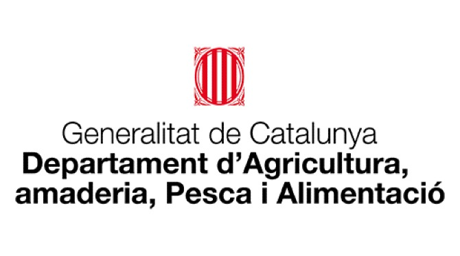
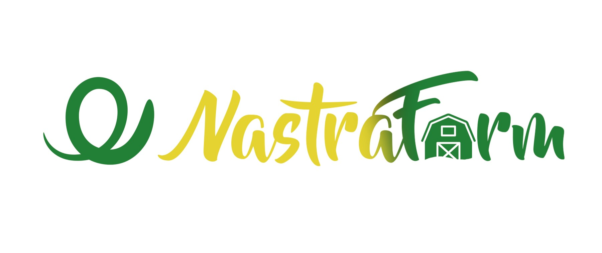

# Origin of the Idea

The idea for the NastrafarmSIGE API originated from the need to improve and automate the management of pig farms in the context of the Integral System for Livestock Farm Management (SIGE) by the Generalitat de Catalunya.

Specifically, this idea was born within the company Nastrafarm S.L., where I, as a volunteer, recognized the challenges faced in managing farm data efficiently.

Traditional farm management methods often involve manual data entry, paper records, and disconnected systems that lead to inefficiencies, errors, and delays in decision-making.

Recognizing these challenges, I decided to develop this API not just as a simple application with authentication and basic database records, but as a robust tool that integrates official services such as the Gestió Telemàtica Ramadera (GTR) of Catalonia, services from Spain’s Ministry of Agriculture, Fisheries and Food (MAPA), SMTP services, PDF and XLSX document generation, and potentially even electronically signable veterinary prescriptions and treatment records. The API connects to various third-party platforms to simplify and digitize the everyday operations of farmers.

